# Хороший макет

- [ ] [Определиться с сеткой сайта](#определиться-с-сеткой-сайта)
- [ ] [Создавайте таблицу стилей](#создавайте-таблицу-стилей)
- [ ] [Предусмотреть сейфзоны](#предусмотреть-сейфзоны)
- [ ] [Именовать и располагать слои в инспекторе осмысленно и иерархически](#именовать-и-располагать-слои-в-инспекторе-осмысленно-и-иерархически)
- [ ] [Использовать систему символов/компонентов](#использовать-систему-символовкомпонентов)
- [ ] [Исключать дробные числа в размерах, расстояниях, координатах](#исключать-дробные-числа-в-размерах-расстояниях-координатах)
- [ ] [Исключать достижения оттенков цвета включением прозрачности](#исключать-достижения-оттенков-цвета-включением-прозрачности)
- [ ] [Проверять на минимальном и максимальном наборе контента](#проверять-на-минимальном-и-максимальном-наборе-контента)
- [ ] [Завести страницу со стайлгайдами](#завести-страницу-со-стайлгайдами)
- [ ] [Завести артборд с контентом, не влезающим за пределы экрана](#завести-артборд-с-контентом-не-влезающим-за-пределы-экрана)
- [ ] [Процесс передачи](#процесс-передачи)

## Определиться с сеткой сайта

Сетка — опора, благодаря которой дизайнер может создать систему расположений объектов внутри проекта. 
Её использование упрощает, в том числе и работу верстальщика. Поэтому важно определиться с сеткой на 
начальных стадиях этапа дизайна

Кроме того, дизайнер не ограничен типовым набором и вправе создавать кастомные, собственные сетки для проекта.

Благодаря сетке и построенному вокруг неё макеты верстальщик знает как и где располагаются ключевые элементы страницы. 
Но иногда дизайнеры намеренно и единично отходят от неё для создания необычного дизайна. Это нормально.

Плохо, когда все же придерживаясь сетки дизайнер начинает постоянно и необоснованно отходить от нее. На одной странице 
блоки располагаются в одном месте, а на следующей они же находятся чуть правее или левее; иконки меняют размер; 
кнопки меняют форму и так далее. В таких случаях процесс вёрстки замедляется, так как верстальщику постоянно 
приходится выяснять, как тот или иной идентичный блок должен располагаться на самом деле. Адаптив также становится 
труднее верстать.

Подробно почитать про сетки можно здесь: [Статья про сетки](https://medium.com/design-spot/%D0%BC%D0%BE%D0%B4%D1%83%D0%BB%D1%8C%D0%BD%D1%8B%D0%B5-%D1%81%D0%B5%D1%82%D0%BA%D0%B8-%D0%B2-%D1%80%D0%B0%D0%B1%D0%BE%D1%82%D0%B5-ux-%D0%B4%D0%B8%D0%B7%D0%B0%D0%B9%D0%BD%D0%B5%D1%80%D0%B0-%D0%B8%D0%BD%D1%81%D1%82%D1%80%D1%83%D0%BA%D1%86%D0%B8%D1%8F-%D0%BF%D0%BE-%D0%BF%D1%80%D0%B8%D0%BC%D0%B5%D0%BD%D0%B5%D0%BD%D0%B8%D1%8E-410cfc1df74d) и [Статья про сетки No2](https://ux.pub/modulnye-setki-v-cifrovyx-interfejsax-istoriya-teoriya-pravila-ispolzovaniya/)

## Определить опорный размер

Наличие сетки это очень круто, но как правило в реальных условиях (особенно в том, что касается разработки веба) нам
оказывается недостаточно одной конкретной сетки. Например, для макета шириной 1400px нам подходит 8px сетка, кнопочки 
встают идеально и все блоки расположены где надо и все счастливы. Но если тот же макет попытаться вместить в 1000px - у
нас возникнут проблемы.

Что бы избежать неприятностей мы предлагаем опираться на некий базовый размер при построении элементов. Например, взять
за основу все те же 8px. Это означает, что все отсупы между элементами, внутри элементов, размеры шрифтов тоже должны
подчиняться некоторой системе. В данном случае, что бы они были кратны 8px (или в крайнем случае 4px или 2px).

Такая мера позволяет очень точно воспроизводить ваши макеты и даже при наличии последнего всего в одном разрешении очень
точно адаптировать его под различные разрешения без потери вашей задумки. 

## Создавайте таблицу стилей

При работе над проектом дизайнер может случайно наплодить кучу текстовых стилей для однотипных случаев. 
Например, незначительно могут отличаться кегль и интерлиньяж в одинаковых абзацах. Это частая проблема больших 
проектов со множеством экранов. Чтобы решить проблему важно вести список стилей для всех элементов. 
Делать это можно вручную на отдельном артборде или средствами редактора — выбор за вами.

Что именно нужно делать? Укажите гарнитуру, начертание, кегль и межстрочное расстояние. Пропишите поведение 
текстов для разных разрешений: как меняются кегль, начертание и интерлиньяж; какие текстовые стили пропадают. 
Список стилей должен быть конечным.

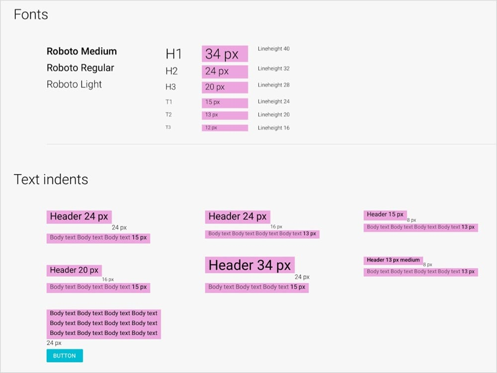

### Объясняйте краевые случаи

Но бывает, что в макете для одного конкретного случая вводится новый текстовый стиль и больше нигде не используется. 
Например, стандартный текст дико смотрится с маленькой иконкой. Оставьте комментарий верстальщику, скажите, что 
это вынужденная мера, и объясните почему.

### Исключите единые текстовые слои

Для этого необходимо разбивать заголовки, подзаголовки, абзацы и списки на отдельные слои. Из одного слоя не 
получится просто узнать параметры заголовка и абзаца. Верстальщики потратят кучу времени, выделяя каждую строку, 
чтобы посмотреть её параметры. В аду приготовлен отдельный котёл для дизайнеров, которые делают горизонтальное 
меню одним текстовым слоем, а пункты отбивают пробелами. Не поленитесь и разбейте меню на отдельные текстовые слои.

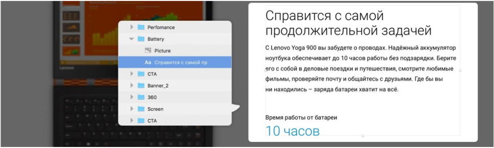

_Плохо: все текстовые стили собраны в одном слое. Сменой интерлиньяжа между стилями не получится привязать слой к 
базовой сетке. Тратится много времени на измерение отступов_

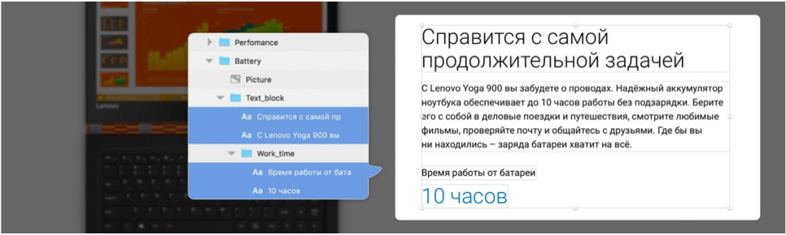

_Хорошо: каждый текстовый элемент — отдельный слой. Не приходится делать лишних телодвижений, чтобы узнать параметры 
текстов. Легко измерить отступы_

### Сгруппируйте списки

В идеале списки должны группироваться так:

* Маркер и строка;
* Общий список;
* Заголовок, абзац и список.

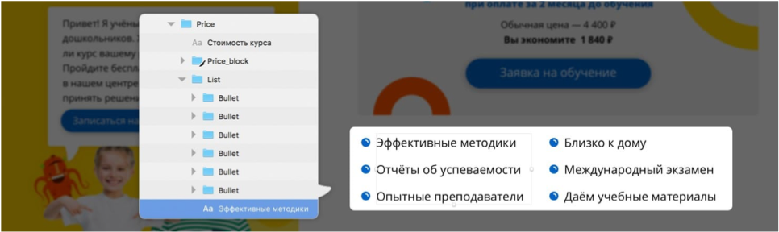

_Плохо: каждый столбик — один слой. Трудно выставить отступы между строками и выровнять маркеры_

Если такой подход удобнее, отбивайте строки не проставлением Enter, а параметром «параграф» на панели текстовых стилей.

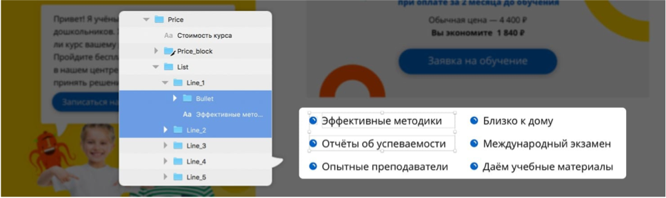

_Хорошо: все строки разбиты по слоям и каждая сгруппирована с маркером. Понятно, как маркер выравнивается относительно 
строки. Легко измерить расстояние между строками и столбцами_

## Предусмотреть сейфзоны

Сейфзона — отличный инструмент для того, чтобы на этапе верстки иконки и объекты можно было позиционировать и заменять 
быстро. Добавляет упорядоченности в макет. Пример: внутри одного списка размеры сэйф-зон должны совпадать.

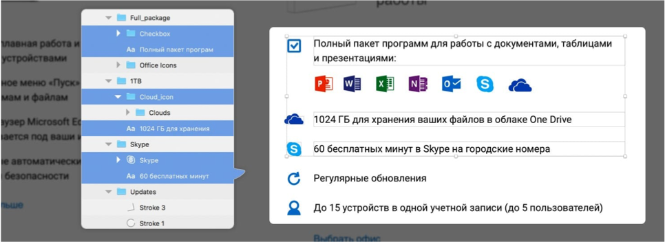

_Плохо: из-за разных размеров иконок каждую приходится выравнивать индивидуально_

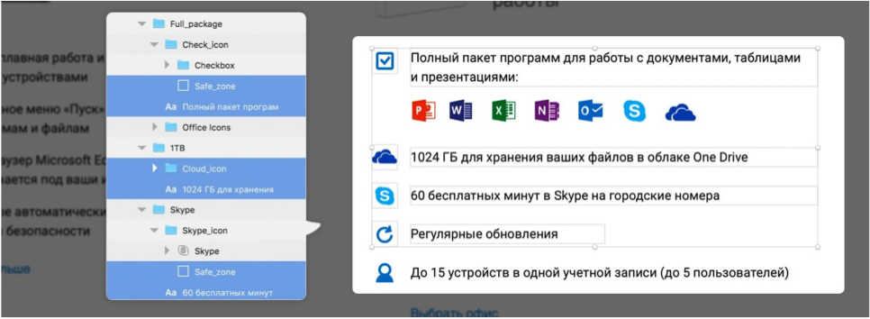

_Хорошо: благодаря одинаковым сэйф-зонам иконки выровняются на вёрстке автоматически_

Сейфзоны могут использоваться не только в случаях с иконками, но и целыми блоками/модулями.

## Именовать и располагать слои в инспекторе осмысленно и иерархически

Дизайнеры любят передавать свои макеты с творческим беспорядком внутри: слои в хаотичном порядке, группы не 
проименованы, а непринятые варианты дизайна спрятаны на чёрный день. Работать с такими макетами сложно и 
верстальщикам, и другим дизайнерам. Поэтому необходимо хорошо группировать макеты.

### Удалите скрытые слои

Часто дизайнеры не удаляют старые варианты дизайна, а прячут их – вдруг пригодятся. Копится мусор, который мешает 
работе верстальщиков.

### Сгруппируйте слои как матрёшки

Например: изображение, текст, кнопка и подложка группируются в карточку, карточки группируются в набор карточек. 
Создавайте группы по тематической принадлежности. Хорошая структура помогает ориентироваться в макете.

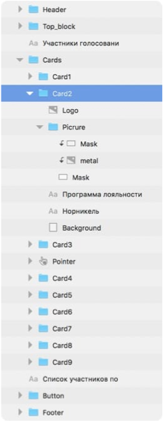

### Дайте понятные имена слоям и группам

Любой человек, который посмотрит на список групп, должен понять, что в них находится. Например, черновая и 
чистовая версии лендинга. Выстраивайте группы в том порядке, в каком модули размещены в макете. Например: хедер 
первый в списке групп, а футер последний.

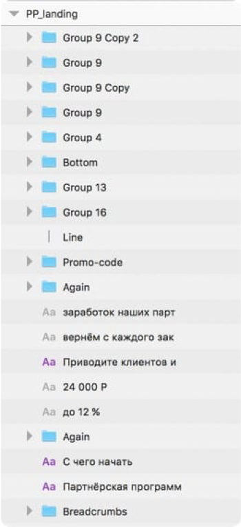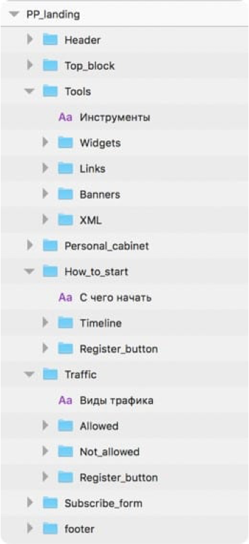

## Использовать систему символов/компонентов

Использование символов/компонентов не только упрощает конструирование страниц, но и помогает создавать иерархию слоёв 
и объектов внутри макета. Это в свою очередь упрощает работу верстальщику. На эту тему можно почитать несколько статей:


* [Организация символов](https://medium.com/slashdesigner/organize-symbols-7ffd38fe228f) в Sketch;
* [Урок по созданию символа](https://www.youtube.com/watch?v=vNd0PoUgl9E) в Sketch;
* [Урок по созданию компонента](https://www.youtube.com/watch?v=CIqtrSM0lwo) в Figma;
* [Архитектура компонентов](https://ux.pub/arxitektura-komponentov-v-figma/) в Figma.

## Исключать дробные числа в размерах, расстояниях, координатах

Иногда на макете в значениях длин, отступов, размерах текста и так далее могут встречаться дробные числа. 
Они вносят путаницу и верстальщик может воспринимать их, как ошибку. Чаще всего при вёрстке значения просто 
округляются и объекты начинают гулять на 1-2 пикселя. Чтобы исключить проблему проверьте все элементы макета и 
посмотрите на расстояния и отступы. Все размеры должны быть выражены целыми четными числами. Не используйте нечетные 
числа и дроби. При работе со шрифтами нужно быть осторожным. Так, если ко всему блоку применили трансформирование, 
то шрифт в нем может увеличиться или уменьшиться до дробных значений.

Многие из этих проблем можно исключить путём использования 8pt сетки. Отличная статья на эту тему: [8pt сетка](https://designpub.ru/https-medium-com-simberev-8pt-grid-for-web-f05fccc956ab)

## Исключать достижения оттенков цвета включением прозрачности

Кроме того, все цветовые значения объектов должны достигаться за счет нативной настройки цвета без применения 
прозрачности. Исключение — сложная графика. То есть получать серый цвет линии за счет уменьшения её 
прозрачности — ошибка. Такой подход лучше исключать.

## Проверять на минимальном и максимальном наборе контента

Создавая блоки надо помнить что они будут наполняться очень разным контентом. Если заранее известно что, например, 
текст внутри блока будет заполняться юзером, то необходимо предусмотреть поведение блока при переполнении 
и наоборот –– отображение при минимальном наборе данных.

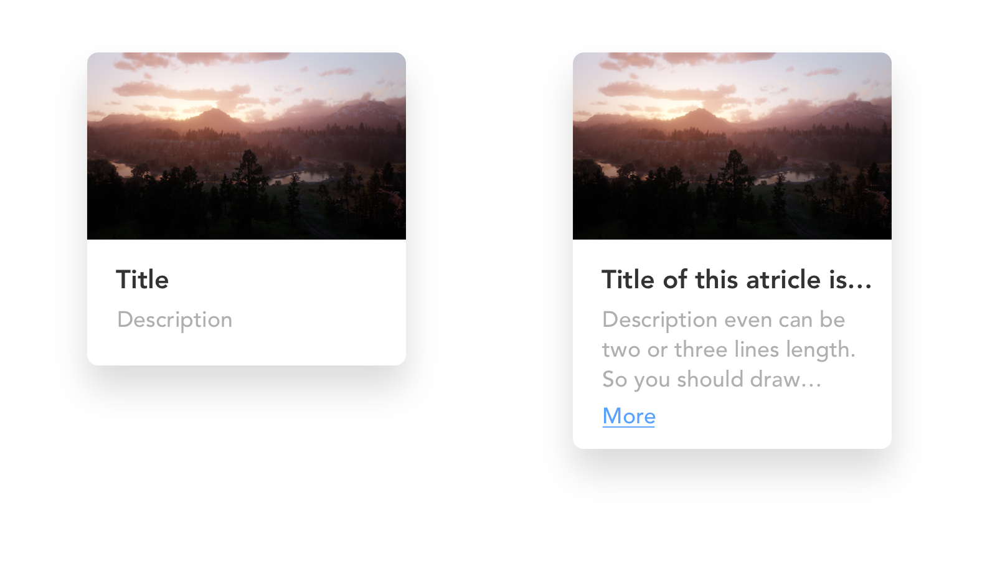

## Завести страницу со стайлгайдами

### Элементы форм и их состояния

### Текстовые стили документа

### Элементы интерфейса

Также можно создавать и артборд со всеми цветами, которые используются в макетах.

Таким образом верстальщик не привязан к мелким недочетам и недоработкам в макетах. Всю необходимую информацию 
о стилях и свойствах объектов он может взять из стайлгайдов. То есть, если дизайнер допустит ошибку в макете, она 
не отразится на вёрстке.

Такой подход также удобен тем, что вместо копирования элементов можно быстро брать их из страницы стайлгайдов в обход 
перегруженной панели с символами.

### Иконки

## Завести артборд с контентом, не влезающим за пределы экрана

Нередко в дизайне встречается решение с каруселью. Во многих случаях в них содержится статичная информация, 
которая не должна заполняться через админ панель сайта. И верстальщик не может узнать, какой именно контент 
находится за границами экрана в карусели. Чтобы этого избежать достаточно вытаскивать обрезаемый экраном контент 
в отдельный артборд.

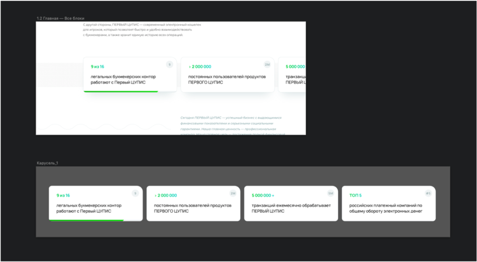

Таким образом верстальщик сможет вытащить текстовый контент из карточек, которые вынесены отдельно он артборда со 
страницей сайта.


## Процесс передачи

После того, как этап дизайна был завершен и был получен зеленый свет от менеджера, необходимо приступать к передаче 
макетов верстальщикам. Данный процесс предусматривает финальное ревью вышеописанных пунктов и передачу артефактов. 
В рамках этапа необходимо:

Если на странице используется анимация, то она должна быть детально описана для того, чтобы верстальщик потратил 
минимальное время на перенос. Для анимирования можно использовать следующее ПО:

* Создать отдельную страницу в документе под вёрстку;
* Перепроверить названия слоёв;

* Избавиться от скрытых слоёв;

* Разблокировать залоченные слои;

* Упаковать на диск ассеты, шрифты, фотографии;

* Передать верстальщику превью макетов в @1х разрешении;
* Описать анимацию и передать сценарии/видео;

### Страница с вёрсткой

Важно создавать новую страницу с вёрсткой. Она предполагает наличие всех страниц, состояний и стайлгайда. 
Эта страница — конечный артефакт, который должен быть направлен в работу верстальщику. Отделение от основной 
страницы с абтбордами полезно тем, что можно продолжать работу над сайтом в рамках документа, не затрагивая то, 
что было отдано верстальщику. При этом важно в случае изменений в основной ветке обновлять страницу с артбордами 
под вёрстку.

### Перепроверка

На новой сформированной странице необходимо финально проверить элементы на готовность к передачена вёрстку.

- Все объекты должны быть корректно названы. Расположены иерархически;
- Все скрытые слои должны быть удалены. Как упоминалось ранее, они мешают верстальщику получать доступ к близлежащим объектам;
- Все слои должны быть разблокированы. Верстальщик не сможет посмотреть свойства заблокированных объектов;
- Должны отсутствовать полупиксели, иначе станет невозможно использовать подход PixelPerfect;
- Все полутона должны быть определены выбором цвета в палитре, а не добавлением прозрачности к цвету.

### Передача объектов

Опционально, но желательно передать верстальщику экспортабельные объекты. Обязательно передать все шрифты, 
используемые в проекте (или дать ссылку на GoogleFonts), фотографии, используемые на сайте.

Важно учесть, что фотографии со стоков должны быть приобретены до передачи в вёрстку, чтобы в дальнейшем не возникло 
потребности заменять из из-за отсутствия прав на использование.

Также верстальщику потребуются все экраны в формате PNG @1x, то есть без масштабирования под ретину. 
Они используются в качестве маски для вёрстки, с помощью которой верстальщик проверяет расположение объектов. 
Без них невозможно сверстать страницу в строгом соответствии с макетом.

### Анимация

Если на странице используется анимация, то она должна быть детально описана для того, чтобы верстальщик потратил 
минимальное время на перенос. Для анимирования можно использовать следующее ПО:


* Principle –– [Уроки](https://ux.pub/poshagovoe-rukovodstvo-po-animacii-interfejsa-v-principle-i-sketch/)
* InVision Studio –– [Уроки](https://www.youtube.com/watch?v=eb3RczbyHUY)
* Protopie –– [Уроки](https://www.youtube.com/watch?v=qdzGW0WhpKA)

Для разработчика мы предоставляем либо видео с письменным описанием поведения анимации. Либо три состояния (начальное, среднее, конечное) с письменным описанием анимации. Оба варианта должны сопровождаться описаниями таймингов и графиками анимации. Это упростит и ускорит работу верстальщиков.
